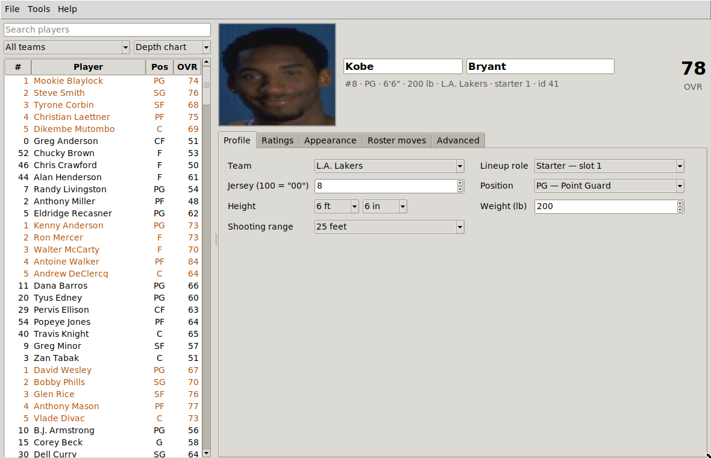
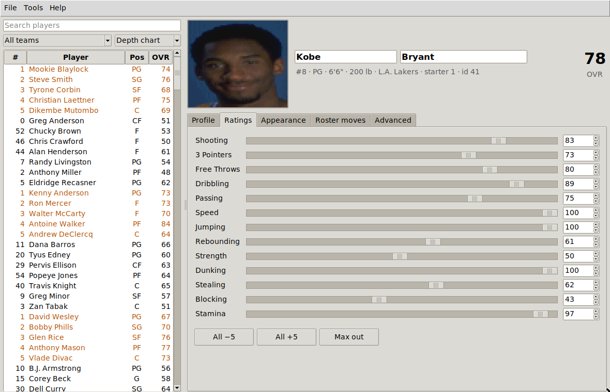
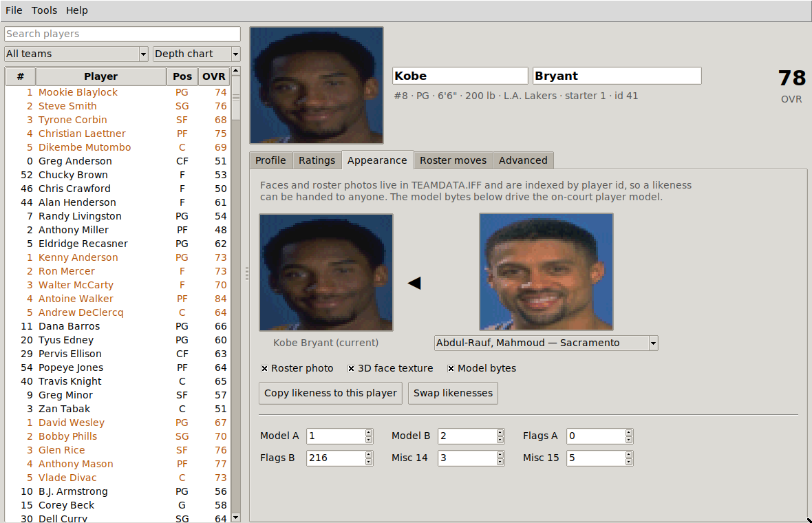
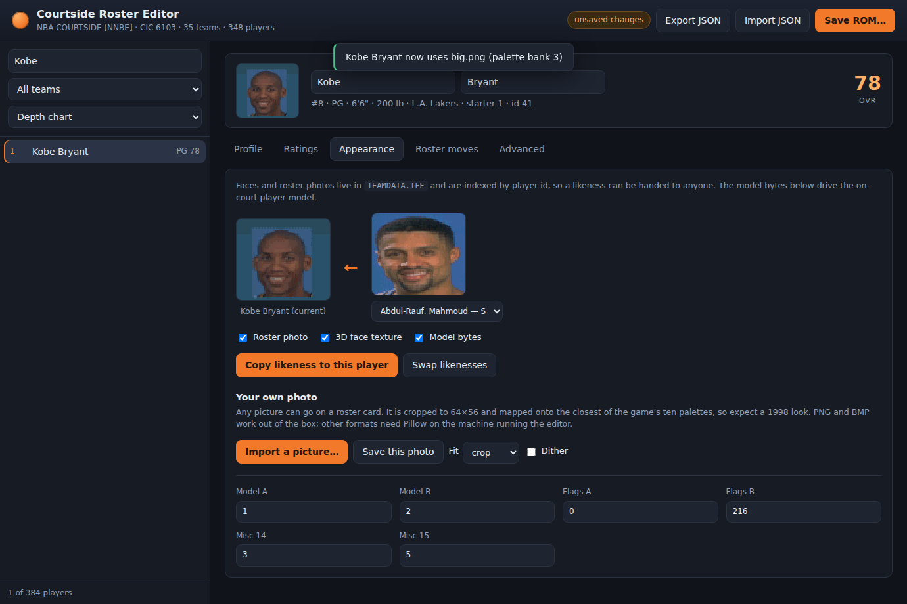

# Kobe Bryant's Courtside Roster Editor

A roster editor for the Nintendo 64 game *Kobe Bryant's NBA Courtside* (1998).
It reads a retail ROM, decodes the game's own compressed data files, lets you
change essentially everything about a player or a team, and writes a playable
ROM back out with a corrected checksum.

Nothing in the game's data was documented anywhere, so the formats were
recovered by disassembling the cartridge. The full write-up is in
[`docs/FILE_FORMATS.md`](docs/FILE_FORMATS.md) — the container format, the
LZSS codec, the 72-byte player record, the position packing, all of it.

It runs entirely offline. No third-party packages, no internet, no accounts —
Python 3.10 or newer and nothing else.



## What you can edit

**Players**
- First and last name (the string pool is extended safely, so renames stick)
- Team, and where the player sits in the depth chart (bench or one of the five
  starting slots)
- Jersey number, including the "00" shirt
- Position — all eleven codes the game supports: `C PF SF F G PG SG FC CF GF FG`
- Height in feet and inches, and weight in pounds
- Shooting range (8, 12, 16, 20 or 25 feet)
- All fourteen ratings: Shooting, 3 Pointers, Free Throws, Dribbling, Passing,
  Speed, Jumping, Rebounding, Strength, Dunking, Stealing, Blocking, Stamina
- The remaining record bytes, exposed raw for experimenting

**Rosters**
- Trade two players between their clubs — both rosters keep their size and the
  players inherit each other's lineup slot
- Sign a player to any team, including the All-Star squads
- Release a player into the Free Agents pool
- A consistency check runs before every save and tells you if a team no longer
  has twelve players or a full starting five

**Appearance**
- Reassign a likeness: give one player another player's roster photograph, his
  3D face texture, his model bytes, or any combination
- Swap two players' looks outright
- Roster photos are decoded and displayed, so you can see what you are picking

**Whole rosters**
- Export everything to JSON, edit it however you like, import it back

## Install and run

There is nothing to install. Download the repository, then double-click
`courtside_gui.py` — or from a terminal:

```sh
git clone https://github.com/richvam/kobe-bryant-s-courtside-roster-editior
cd kobe-bryant-s-courtside-roster-editior

python3 courtside_gui.py                  # pick a ROM from the file dialog
python3 courtside_gui.py courtside.z64    # or open one straight away
```

`.z64`, `.n64` and `.v64` dumps are all accepted; the byte order is normalised
on load. You need to supply your own ROM — none is included here, and none
will be.

### Requirements

Python 3.10 or newer with Tkinter, which drives the window. The python.org
installers for **Windows and macOS bundle it**, so there is nothing else to do
there. On Linux it is usually a separate package:

```sh
sudo apt install python3-tk        # Debian, Ubuntu, Mint
sudo dnf install python3-tkinter   # Fedora
sudo pacman -S tk                  # Arch
```

If Tkinter is missing the launcher tells you exactly this and points you at the
command line, which works without it.

## The desktop editor

| | |
| --- | --- |
|  |  |

Pick a player on the left, edit on the right; every change is applied to the
in-memory ROM immediately. **File → Save ROM As…** writes a fresh file — your
original is never touched. Saving repacks the game's compressed data, which
takes a few seconds and runs in the background so the window stays responsive.

The list can be filtered by team and searched by name, jersey or player id, and
sorted by depth chart, name, overall or number. **Tools → Check roster
consistency** reports any team that has drifted from twelve players and a full
starting five.

### A browser version too

If you would rather work in a browser — or want to edit from another machine on
your own network — the same editor is available as a local page:

```sh
python3 -m courtside courtside.z64 serve
```

That serves `127.0.0.1` from Python's own HTTP server. It is still fully
offline: no CDNs, no external requests, nothing leaves your machine.



## The command line

Every editing command takes `-o/--output` and writes a new ROM.

```sh
# look around
python3 -m courtside rom.z64 info
python3 -m courtside rom.z64 teams --verbose --nba-only
python3 -m courtside rom.z64 list --team Lakers
python3 -m courtside rom.z64 list --sort overall | head -20
python3 -m courtside rom.z64 show "Reggie Miller"

# edit a player
python3 -m courtside rom.z64 set "Kobe Bryant" -o out.z64 \
    --jersey 24 --position SG --height 6'7\" --weight 212 \
    --attr three_pointers=95 --attr dunking=100 --starter 1

# roster moves
python3 -m courtside rom.z64 trade "Kobe Bryant" "Karl Malone" -o out.z64
python3 -m courtside rom.z64 move "Michael Finley" Chicago -o out.z64 --starter 2
python3 -m courtside rom.z64 release "Greg Ostertag" -o out.z64

# likenesses
python3 -m courtside rom.z64 appearance "Sean Rooks" "Kobe Bryant" -o out.z64
python3 -m courtside rom.z64 appearance "Shaquille" "Muggsy Bogues" --swap -o out.z64
python3 -m courtside rom.z64 photo "Tim Duncan" -o duncan.png --scale 6

# bulk work
python3 -m courtside rom.z64 export -o roster.json
python3 -m courtside rom.z64 import roster.json -o out.z64

# sanity check: does the codec reproduce this ROM byte for byte?
python3 -m courtside rom.z64 verify
```

`show` prints a full card:

```
Reggie Miller  (#31, SG)
  id 205    team Indiana            starter 2
  6'7", 185 lb   shooting range 25 ft
  ratings:
    Shooting       100  ####################
    3 Pointers     100  ####################
    Free Throws     88  ##################
    ...
```

## Using it as a library

```python
from courtside import RosterEditor

ed = RosterEditor.open("courtside.z64")

kobe = ed.one("Kobe Bryant")
kobe.jersey = 24
kobe.set_height(6, 7)
kobe.set_attribute("three_pointers", 95)

ed.trade("Kobe Bryant", "Karl Malone")
ed.reassign_appearance("Sean Rooks", "Kobe Bryant")

report = ed.save("out.z64")
print(report.teaminfo, report.warnings)
```

The package is layered so the lower pieces are useful on their own —
`courtside.lzss` (the codec), `courtside.iff` (the container),
`courtside.rom` (ROM header, CRC and the packed-file table),
`courtside.roster` and `courtside.appearance` (the data models).

## How edits get back into the ROM

The roster lives in `TEAMINFO.IFF`, a block-addressed container of LZSS
streams. The editor decodes it, applies your changes, and re-packs it —
recompressing only the blocks that actually changed, so an untouched file comes
back byte for byte identical (there is a test for exactly that).

Because the encoder does a shortest-path parse over the format's real bit
costs, the re-packed file usually ends up *smaller* than the original, so it
drops straight back into its existing slot. If an edit ever did overflow, the
file is relocated into the ROM's trailing filler and its entry in the packed
file table is updated. Either way the header CRC is recomputed with the
cartridge's CIC-6103 seed before the ROM is written.

## Tests

```sh
python3 tests/test_courtside.py                       # codec + model tests
COURTSIDE_ROM=/path/to/rom.z64 python3 tests/test_courtside.py   # everything
```

The ROM-backed tests check that both packed files re-pack byte-identically,
that edits survive a save-and-reload, that a saved ROM's CRC validates, and
that trades and releases leave the roster tables consistent.

## Troubleshooting

**"No module named tkinter"** — install the package for your distribution (see
Requirements above). Everything except the desktop window works without it.

**The window will not open over SSH or on a headless box** — use the browser
version (`serve`) or the command line.

**Saving takes a few seconds** — the game's data is compressed and has to be
repacked. Reassigning a likeness makes it slower still, because `TEAMDATA.IFF`
is 1.3 MB of packed art. The window stays responsive while it works.

## Compatibility

Developed against the US release (`NBA COURTSIDE`, cart id `NNBE`,
12 MiB, CIC-NUS-6103, MD5 `d37c79e4e4eabcb5dc6a07bd76688223`). The packed-file
table is located by validating its offset chain rather than by a hard-coded
address, so other revisions have a fair chance of working — but they are
untested. Run `verify` first if you try one.

Edited ROMs run on hardware and on emulators. Keep your original around.

## Licence

MIT, see [LICENSE](LICENSE). This project ships no game data. *Kobe Bryant's
NBA Courtside* is © Nintendo / Left Field Productions; the NBA marks belong to
their owners.
